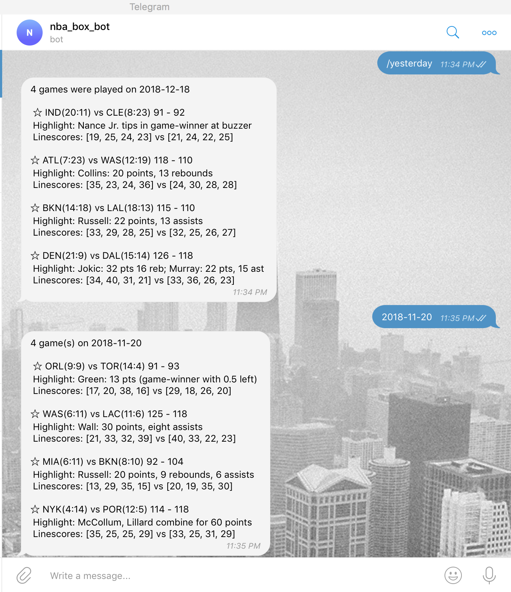

[](https://www.elegantobjects.org)
[](LICENSE.md)

# NBA scoreboards
> Telegram bot that serves latest nba games statistics.

## Tools/features
> - python 3.6+
> - [flask](http://flask.palletsprojects.com)

## Usage
Run script from the root directory of the project:
```bash
~ python bot.py
```

## Demo


## Development notes

### Meta
Author – Volodymyr Yahello vyahello@gmail.com

Distributed under the `MIT` license. See [LICENSE](LICENSE.md) for more information.

You can reach out me at:
* [https://github.com/vyahello](https://github.com/vyahello)
* [https://www.linkedin.com/in/volodymyr-yahello-821746127](https://www.linkedin.com/in/volodymyr-yahello-821746127)

### Contributing
1. clone the repository
2. configure Git for the first time after cloning with your `name` and `email`
3. `pip install -r requirements.txt` to install all project dependencies
